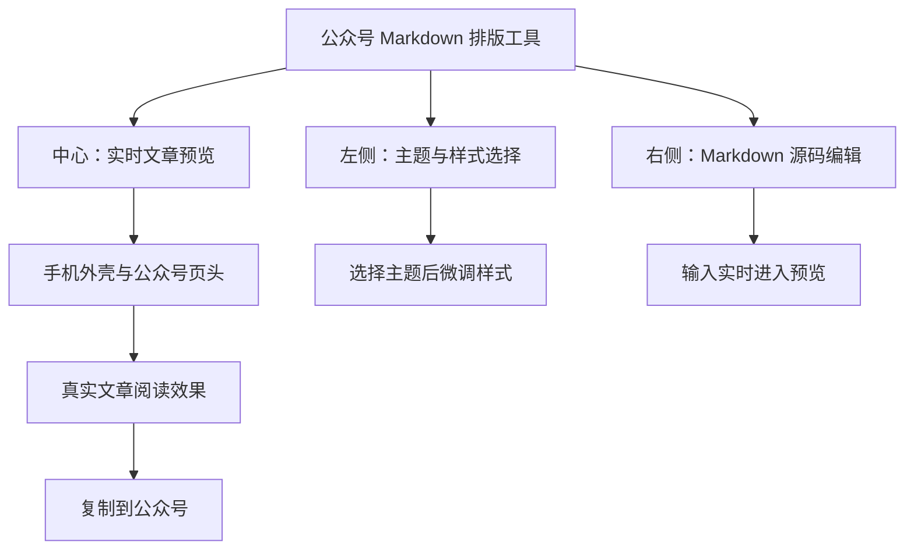
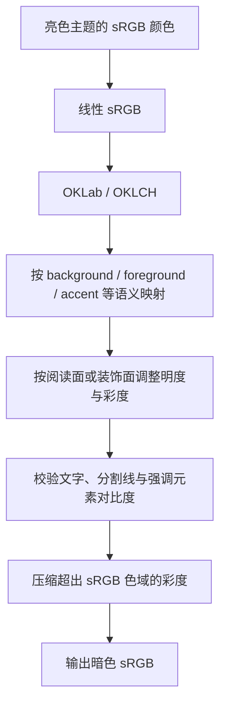

# 墨鱼排版产品与主题设计规范

## 适用范围

本文件是墨鱼排版的产品视觉、主题契约和亮暗外观算法的仓库级事实源。涉及页面布局、设计系统、主题数据、主题渲染、样式编辑和预览交互的改动都必须遵守本文件；实现发生调整时，同步更新这里的最终有效规则。

## 产品定位与视觉主次

墨鱼排版是面向微信公众号的 Markdown 在线编辑与实时排版工具。产品界面的唯一视觉主角是文章预览，站点外壳、主题选择器和编辑器都为预览服务。



### 整体调性

- 界面保持清爽、克制、内容优先，使用轻字重、低饱和中性色和充足留白。
- 站点外壳使用淡色、低对比度层级；主题的鲜明色彩集中在文章预览中。
- 通过背景层级表达容器关系。两个表面已有明显色差时，不叠加冗余完整边框。
- 阴影只用于浮层、手机外壳和确实需要抬升的交互层，不作为普通卡片的默认装饰。
- 图标统一使用项目现有的 Tabler 图标，不使用 Emoji 作为结构性图标。
- 交互状态通过颜色、透明度或阴影变化表达，不改变控件尺寸，避免页面晃动。

### 工作台布局

- 桌面端采用左、中、右三栏：左侧主题与样式，中间手机预览，右侧 Markdown 编辑器。
- 中间预览保持最强视觉对比；左侧宽度克制，右侧获得足够编辑空间。
- 三栏头部使用一致的高度、边线、内边距和文字层级。
- 页签切换、主题切换和样式面板切换不改变三栏基础宽度，不产生横向跳动。
- 中间只提供公众号手机预览，不提供桌面预览。手机最大高度受当前页面可用高度约束，文章在手机内部独立滚动。
- 手机预览包含状态栏、公众号页头、作者信息和关注入口，使用户能直接感知公众号中的阅读场景。
- 顶部保持完整网站头部，只保留站点身份和核心复制动作。Markdown 导入位于编辑器区域。

### 左侧主题与样式

- “主题”和“样式”属于同一设置区域：先选择主题，再在样式页签中做细节调整。
- 主题不提供名称搜索。主题数量通过明确的色调分类和紧凑卡片完成浏览。
- 色调分类固定为单行横向滚动，顺序为：`全部`、`黑白`、`多彩`、`暖色`、`冷色`。
- `黑白`与`多彩`构成色彩复杂度维度的一组对照；`暖色`与`冷色`构成色温维度的一组对照。主题存在真实交叉倾向时可以声明多个分类。
- 主题卡只展示主题名称、阅读底色、正文色、主色和次色，不缩放渲染真实文章效果。
- 主题名称保持简短、小字号和清楚辨识。主题契约不包含用途、推荐场景或说明文字。

### 编辑器与实时预览

- 编辑器显示 Markdown 源码文本，不套用文章主题字体、字号、颜色或装饰。
- 编辑器不显示行号；保留 Markdown 语法高亮、编辑工具、搜索、撤销重做和导入能力。
- Markdown 内容、主题选择和样式覆盖必须使用同一状态源，任何修改都实时进入中间预览。
- 样式修改不能只更新控件或持久化数据，必须沿“写入 → 展示 → 选择 → 渲染”链路进入最终预览。
- 亮色/暗色切换位于预览区头部。切换主题时保留当前亮暗外观，重复点击当前主题不改变外观。
- 首次进入且 URL 与本地存储都没有有效外观时使用亮色。

## 主题集合设计

### 主题分布

- 主题集合覆盖黑白、多彩、暖色、冷色四个阅读色调区间，并保持数量与风格的基本平衡。
- 新主题必须提供清楚的视觉语气，而不只是替换一组颜色。
- 与已有主题在字体、标题结构、装饰语言和主次色关系上高度雷同的方案不进入集合。
- 黑白主题强调秩序、留白、字重和排版结构；多彩主题强调有节制的综合色彩关系。
- 暖色主题偏纸张、大地、出版物和人文气质；冷色主题偏理性、技术、玻璃、蓝图和现代编辑感。
- `palette.colorFamilies` 只表达实际存在的色彩倾向。潮流黑卡按冷色归类，新中式按暖色归类，不能仅依据名称中的“黑”或视觉印象误判为深色类别。

### 主题数据契约

- 主题定义集中在 `src/data/themes.json`，类型契约集中在 `src/domain/theme-types.ts`。
- `id` 与 `value` 是稳定唯一身份；`label` 是面向用户的简短中文名称。
- `palette.colorFamilies` 只能使用 `monochrome`、`colorful`、`warm`、`cool`，主要分类字段排在辅助字段之前。
- 内置主题以亮色作为设计基准，通过统一算法生成同版式暗色外观。
- `palette.primary` 与 `palette.secondary` 是主题主色和次色，也是主题卡的具象色调来源。
- 文章背景和正文色来自 `config.base` 与 `config.block.container`，不在其他字段重复维护。
- `config` 是主题样式唯一事实源；`section_html` 只承担兼容回退，不复制一套独立主题逻辑。
- 主题不保存用途、建议或描述字段。用户通过主题名称、调色板和实时预览判断是否适合。

### 亮暗配对契约

- 每套主题必须同时支持亮色和暗色，亮暗外观共享完全相同的 HTML 结构、排版几何和交互行为。
- 亮暗切换只允许改变颜色及透明度，不改变字号、字重、间距、圆角、边框宽度、划线宽度、模板结构或装饰形状。
- 链接下划线固定为 `1px`，避免与加粗强调混淆。
- 加粗文字的划线或色带在亮暗外观中保持相同几何形态；暗色只调整其颜色和透明度，不能变细、变圆或改变位置。
- Markdown 有序列表和无序列表必须保留明确的序号或项目符号，不能退化成普通缩进文本。

## 主题语义色系统

主题颜色必须先归入语义角色，再参与亮暗映射：

| 语义角色 | 用途 |
| --- | --- |
| `background` | 页面、阅读块、标题块、标签和装饰填充 |
| `foreground` | 正文、说明和普通局部文字 |
| `headline` | 标题及标题组件文字 |
| `accent` | 主色、次色、编号、项目符号和装饰重点 |
| `border` | 具有结构作用的边框与轮廓 |
| `divider` | 标题分割线、水平线和下划线 |
| `shadow` | 必要的层级阴影 |

- 组件变量优先使用能表达语义的名称，例如 `title_color`、`chip_bg`、`line_color`，并在模板中明确文字与背景的配对关系。
- 模板中的硬编码颜色必须能从 CSS 声明属性推断语义；复杂组件优先把颜色抽成 `style` 变量，以便执行局部对比度校正。
- 正文与主阅读背景的对比度目标不低于 `7:1`。
- 普通文字与局部背景的对比度不低于 `4.5:1`；次要文字不低于 `3:1`。
- 主色、图形和其他非文字关键元素与相邻背景的对比度不低于 `3:1`。
- 分割线在亮暗外观中都必须可见，与相邻背景的对比度不低于 `3:1`。
- 强调色带与正文背景保持不低于 `1.6:1` 的可见差异，同时色带上的文字不低于 `4.5:1`。
- 填充形状与周围背景已达到 `1.35:1` 的清楚色差时，移除完整 `border` 或 `outline`；承担方向或语义作用的单侧强调边框可以保留。

## 暗色外观算法

暗色外观统一使用 `src/domain/perceptual-color.ts` 与 `src/domain/theme-appearance.ts` 中的 OKLCH 感知色彩算法。禁止使用 RGB 通道反相或统一叠黑/叠白作为主题暗色方案。

### 转换流程



### 阅读表面

- 暗色主背景以主题主色的色相轻微着色：OKLCH 明度为 `0.145`，有彩主色的背景彩度限制在 `0.012–0.03`。
- 暗色正文前景的 OKLCH 明度为 `0.94`，只保留极少量主题色倾向，确保主阅读面对比度不低于 `7:1`。
- 阅读类背景与暗色主背景混合时，主背景权重为 `0.72`，使引用、表格、代码和内容容器保持克制、稳定、适合长文阅读。
- 装饰类背景与暗色主背景混合时，主背景权重为 `0.48`，保留标题块、标签和视觉组件的主题彩度。

### 主次色与装饰色

- 有彩强调色尽量保持原色相；高彩度颜色保留全部彩度，低彩度颜色至少保留约 `90%` 彩度。
- 强调色从 OKLCH 明度 `max(0.62, 原色明度)` 起步，每次增加 `0.01`，直到满足角色要求的对比度。
- 两个有彩颜色混合时沿最短色相路径插值，并按双方彩度加权色相；一方接近中性时使用彩度占优一方的色相。
- 颜色超出 sRGB 色域时只压缩彩度，保持明度和色相不变。
- 多彩主题暗色外观必须保留原主次色辨识度，不能统一变成灰蓝或灰黑。

### 局部文字与背景

- 组件模板解析所有嵌套 HTML 标签，建立文字变量与当前或继承背景变量的配对。
- 局部文字优先保留映射色、主题原色和全局前景色；对比度不足时选择能覆盖所有关联背景的近黑或近白。
- 所有候选仍不足 `4.5:1` 时允许使用纯黑或纯白兜底。兜底是局部文字极性选择，不能通过整体压暗主题色代替。
- 同一颜色会出现在多个表面时，以最差表面的对比度作为判断依据。

## 新增或调整主题的验证

### 自动化验证

- 有分支的主题映射逻辑遵循 TDD，先补失败测试，再实现算法。
- `src/domain/perceptual-color.test.ts` 覆盖色相保持、彩度保持、暗色阅读面和色域转换。
- `src/domain/theme-appearance.test.ts` 覆盖全部内置主题的亮暗可读性、几何一致性、局部文字配对、分割线和强调色带。
- `src/domain/theme-renderer.test.ts` 覆盖 Markdown 列表、标题、引用、表格、代码和组件渲染。
- 完成改动后运行：

  ```bash
  npm test
  npm run build
  ```

### 视觉与公众号验证

- 使用 `demo.md` 同时检查长标题、长段落、有序与无序列表、引用、表格、代码、图片、链接、加粗和删除线。
- 每个新增主题都检查亮色与暗色；主题算法调整至少抽查黑白、多彩、暖色、冷色各一套代表主题。
- 重点检查暗色大标题、局部彩色填充上的文字、标题分割线、加粗划线和引用中的强调文字。
- 手机预览中的文章滚动、公众号页头和作者区域必须与主题亮暗同步。
- 浏览器预览通过后，将结果复制到微信公众号草稿箱验证；公众号粘贴结果是兼容性的最终判定。
