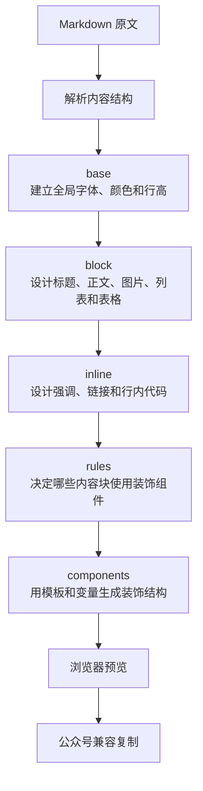

# 为墨鱼排版贡献主题

谢谢你愿意把审美和经验带进墨鱼排版。

这份指南主要说明如何贡献一套新主题。交互改进、内容块支持和问题修复也同样欢迎；如果改动方向还不确定，可以先提交 Issue，附上使用场景、参考图片或你希望解决的排版问题。

## 什么样的主题适合加入

我们期待的不只是“换一组颜色”，而是一套有明确使用场景、阅读节奏和视觉判断的排版方案。

- **先服务内容**：正文长时间阅读不吃力，标题层级容易辨认。
- **有完整语气**：字体、颜色、留白、边框和装饰来自同一套视觉逻辑。
- **说明适用场景**：让使用者能判断它适合教程、品牌故事，还是强视觉营销内容。
- **兼顾公众号限制**：复制到公众号后仍然稳定，不依赖外部 CSS、脚本或交互状态。
- **尊重原创**：可以研究优秀作品，但请避免直接复制他人的独有版式、素材或品牌资产。

## 主题如何工作

Markdown 会先被解析为标题、正文、列表、引用等内容块，再由主题配置逐层赋予样式和装饰。



主题保存在 [`src/data/themes.json`](./src/data/themes.json)，对应的 TypeScript 契约位于 [`src/domain/theme-types.ts`](./src/domain/theme-types.ts)。

## 最小主题结构

建议先复制一套气质最接近的现有主题，再逐层调整。下面的例子只保留主题工作的核心字段：

```json
{
  "id": "quiet-editorial",
  "value": "quiet-editorial",
  "label": "静谧书刊",
  "description": "低饱和纸张色与克制标题，适合书评、随笔和长篇人文内容。",
  "primary_color": "#5F665E",
  "author": "your-github-name",
  "type": "unified",
  "config": {
    "base": {
      "color": "#343834",
      "font-size": "16px",
      "font-family": "-apple-system, BlinkMacSystemFont, 'Segoe UI', sans-serif",
      "line-height": "1.9",
      "background-color": "#F7F5EF"
    },
    "block": {
      "container": {
        "max-width": "720px",
        "margin": "0 auto",
        "padding": "16px"
      },
      "p": {
        "margin": "18px 0",
        "font-size": "15px",
        "line-height": "2"
      },
      "h2": {
        "margin": "36px 0 20px",
        "font-size": "22px",
        "font-weight": "700"
      }
    },
    "inline": {
      "strong": {
        "color": "#3F5948",
        "font-weight": "700"
      }
    },
    "rules": {
      "h2": {
        "decoration": "section_heading",
        "replace_original": true
      }
    },
    "components": {
      "section_heading": {
        "enabled": true,
        "style": {
          "accent_color": "#7D8F82"
        },
        "template": "<section style=\"margin: 36px 0 20px; padding-left: 12px; border-left: 3px solid {{accent_color}}; font-size: 22px; font-weight: 700\">{{content}}</section>"
      }
    }
  }
}
```

### 主题身份

| 字段 | 用途 |
| --- | --- |
| `id` / `value` | 稳定且唯一的主题标识。新增后不要随意修改，否则已有链接和选择记录会失效。 |
| `label` | 面向用户的中文名称，直接表达视觉气质。 |
| `description` | 说明风格、内容类型和适用场景，不堆砌抽象形容词。 |
| `primary_color` | 主题卡片和界面提示使用的代表色。 |
| `author` | GitHub 用户名或希望展示的作者名。 |

`section_html` 是旧主题的兼容回退，新主题应以 `config` 为唯一事实源，不需要手写一份重复的静态预览。

### `base`：建立整体基调

`base` 负责全文默认的字体、字号、文字颜色、行高、对齐和背景。先把这一层调顺，再进入具体内容块，能够避免每个模块重复定义同一批属性。

### `block`：设计内容块

`block` 以 Markdown 内容类型为键。常用键包括：

- `container`、`p`、`h1` 至 `h6`
- `blockquote`、`ul`、`ol`
- `table`、`thead`、`tr`、`th`、`td`
- `figure`、`image`、`figcaption`
- `hr`、`code_pre`

样式会转换成内联 CSS。请优先使用公众号编辑器能够稳定保留的基础属性，例如颜色、字号、行高、边距、内边距、边框和背景。

### `inline`：设计行内文字

`inline` 负责不应打断段落流的内容，常用键包括 `strong`、`em`、`del`、`link`、`codespan` 和 `listitem`。

强调样式要足够清楚，但不要依赖极端字距或复杂定位。公众号会重新清洗粘贴的 HTML，语义和可读性要优先于浏览器专属效果。

### `rules` 与 `components`：建立主题辨识度

`rules` 决定某类内容是否由装饰组件替换或补充；`components` 提供具体 HTML 模板和可编辑变量。

- `replace_original`：使用组件替换原内容块。
- `decoration`：指向 `components` 中的组件名称。
- `auto_number`：为支持的标题组件提供自动编号。
- `insert_after`：在指定内容块后插入装饰。
- `variant`：选择组件的一个模板变体。

模板可使用 `{{content}}`、`{{number}}`，也可以引用组件 `style` 中的变量。请保持结构简洁，并为正文较长、标题换行和手机宽度不足的情况留出弹性。

## 制作一套主题

1. Fork 仓库并安装依赖：

   ```bash
   npm run setup
   ```

2. 在 [`src/data/themes.json`](./src/data/themes.json) 中复制最接近的主题，先修改身份字段，再从 `base`、`block`、`inline` 到装饰组件逐层调整。
3. 在 [`src/domain/template-categories.ts`](./src/domain/template-categories.ts) 中，把新主题 ID 登记到一至两个最适合的内容分类。不要为了增加曝光把它放进所有分类。
4. 启动本地工作台，用完整的 `demo.md` 检查所有内容块：

   ```bash
   npm run dev
   ```

5. 在桌面和手机预览中检查长标题、长段落、表格、代码、图片、引用和列表。
6. 点击「复制到公众号」，实际粘贴到公众号草稿箱，确认结构和换行没有被微信重写。

## 公众号兼容原则

- 所有必要样式必须写入元素的 `style`，不要依赖外部样式表或 class。
- 不使用脚本、表单、悬浮交互或必须点击后才出现的内容。
- 谨慎使用 `position`、滤镜、混合模式和复杂布局；它们可能被公众号过滤。
- 不用不可公开访问的字体、图片和本地文件路径作为主题依赖。
- 颜色需要同时考虑浅色背景、深色模式处理和文字对比度。
- 浏览器预览只是第一步，公众号草稿箱中的粘贴结果才是最终兼容标准。

## 提交前检查

主题逻辑和数据契约有自动测试；静态文案和具体视觉效果需要人工审查。

```bash
npm test
npm run build
```

提交 Pull Request 前，请确认：

- [ ] 主题名称和描述能够让用户判断适用场景。
- [ ] `id` 与 `value` 唯一且稳定。
- [ ] 正文、标题、引用、列表、表格、代码和图片都有合理样式。
- [ ] 桌面与手机预览没有溢出或遮挡。
- [ ] 已在微信公众号草稿箱中验证复制结果。
- [ ] 没有提交 `dist`、`.wrangler`、环境变量、Token 或本地调试文件。
- [ ] 新增主题已经登记到合适的内容分类。
- [ ] 测试和生产构建全部通过。

Pull Request 中请附上主题定位、适用场景，以及至少一张完整文章截图。说明你做了哪些关键视觉判断，会比只罗列颜色值更有助于评审。
