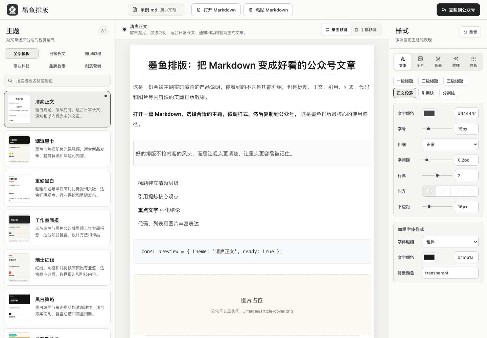
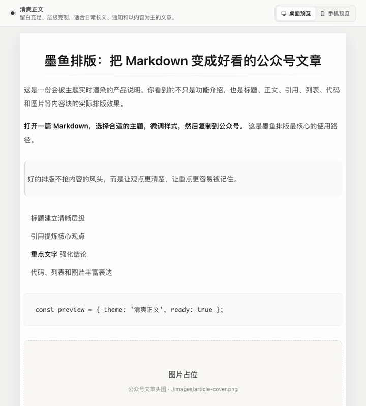
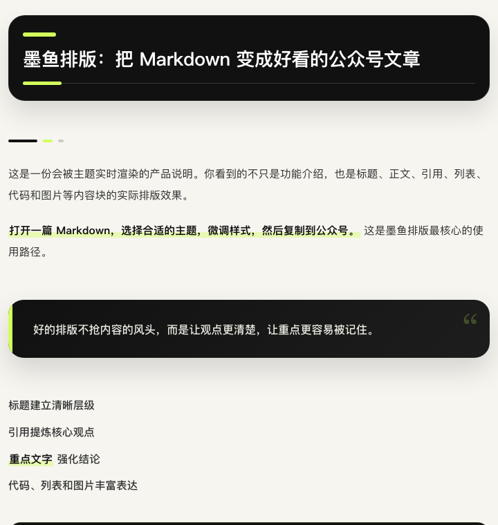
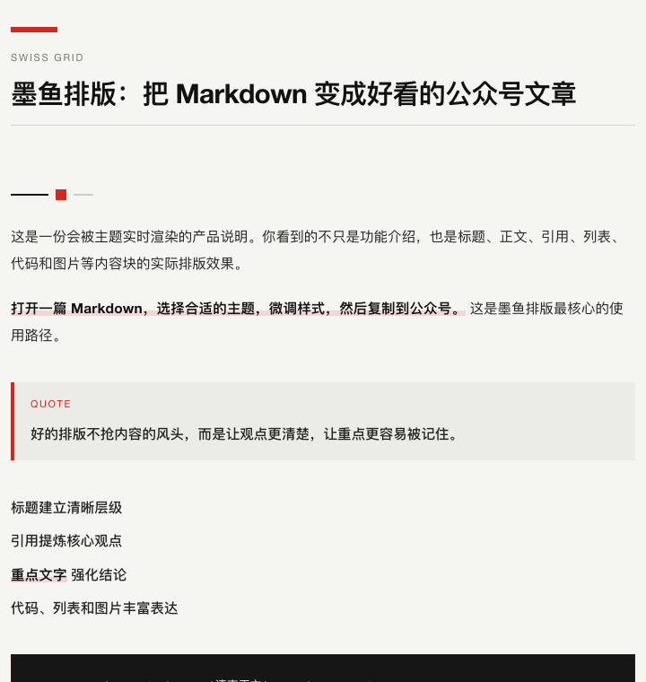
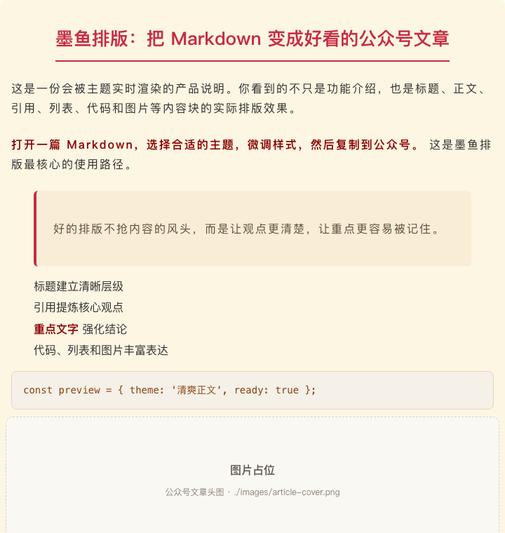
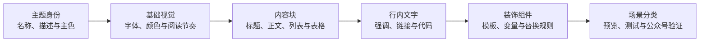

<p align="center">
  
</p>

<h1 align="center">墨鱼排版</h1>

<p align="center">
  把 Markdown 变成好看的公众号文章。<br>
  打开文件，挑选主题，微调样式，然后直接复制到公众号。
</p>

<p align="center">
  <strong>31 套主题</strong>　·　<strong>5 类内容场景</strong>　·　<strong>3 种导入方式</strong>　·　<strong>无需注册</strong>　·　<strong>内容不上传</strong>
</p>

<p align="center">
  <a href="https://moyu.liaobuqi.ren"><strong>在线体验 →</strong></a>
</p>



## 写好内容，剩下的交给墨鱼

公众号排版不应该从反复调字号、间距和颜色开始。

墨鱼排版把常用的排版能力放进一个清晰的工作台：左边选主题，中间看真实效果，右边微调细节。你可以打开本地 Markdown、直接拖入文件，也可以粘贴内容；满意后点击「复制到公众号」，回到编辑器粘贴即可。

整个过程只有三步：

1. **放入文章**：打开、拖入或粘贴 Markdown。
2. **选好风格**：从 31 套主题中找到适合内容的一套，实时查看效果。
3. **复制发布**：一键复制公众号富文本并打开公众号后台，直接粘贴后继续发布。

## 换个主题，文章马上换种气质

<p align="center">
  
</p>

主题不是简单换个颜色。标题、正文、引用、列表、代码、图片和装饰模块都会随主题重新组织，让同一篇文章适配不同的表达场景。

<table>
  <tr>
    <td align="center"></td>
    <td align="center"></td>
    <td align="center"></td>
  </tr>
  <tr>
    <td align="center"><strong>潮流黑卡</strong><br>新品发布、趋势解读、年轻化内容</td>
    <td align="center"><strong>瑞士红线</strong><br>商业分析、数据报告、科技内容</td>
    <td align="center"><strong>新中式</strong><br>节气、茶文化、传统故事</td>
  </tr>
</table>

除此之外，还有文学留白、典雅品牌、极客蓝图、孟菲斯彩块、千禧霓虹、暖调复古等风格。主题按「日常长文、知识教程、商业科技、品牌故事、创意营销」分类，也可以直接搜索名称和用途。

## 不只是套模板

- **31 套即用主题**：从克制长文到强视觉海报，覆盖常见公众号内容。
- **5 组样式设置**：按文本、图片、背景、装饰和底板微调，不必改 CSS。
- **桌面与手机预览**：在发布前检查不同阅读尺寸下的实际表现。
- **图表自动转图片**：识别 Mermaid、Graphviz 图表，在浏览器本地转成高清 PNG Base64。
- **表格直接排版**：支持 GFM 表格、任务列表与删除线，常见 Markdown 内容无需手工改写。
- **常用代码高亮**：支持 JSON、Java、TypeScript、Kotlin、Shell、YAML、SQL 等常用语言，复制后保留颜色层次。
- **中文文件名可直接使用**：选择 `.md` 或 `.markdown` 文件即可载入。
- **真实内容块预览**：标题、引用、列表、代码、强调文字和图片占位都会呈现。
- **本地读取**：浏览器打开或粘贴的文章只在当前页面生效，刷新后回到示例文档。
- **公众号富文本复制**：预览满意后直接复制，不需要手工重排一遍。
- **手机阅读模式**：移动端自动隐藏复杂编辑面板，像阅读公众号文章一样浏览，并可从底部快速切换主题。

## 图表代码，也能直接带进公众号

Markdown 中使用 `mermaid`、`dot` 或 `graphviz` 代码块即可。打开或粘贴文章时，墨鱼会按需载入对应渲染器，在当前浏览器中生成 PNG，再以内嵌 Base64 图片参与预览和复制。


流程图、时序图、类图、状态图、ER 图、甘特图、思维导图等 Mermaid 支持的图表都可以使用；Graphviz 用户也可以继续使用熟悉的 DOT 语法。整个过程不依赖服务端，图表源码不会上传。

## 适合这些内容

| 内容场景 | 推荐方向 |
| --- | --- |
| 日常长文 | 随笔、通知、社群内容、个人专栏 |
| 知识教程 | 方法说明、工具教程、经验复盘 |
| 商业科技 | 产品发布、行业观察、数据报告 |
| 品牌故事 | 人物访谈、品牌文化、生活方式 |
| 创意营销 | 活动宣传、热点表达、海报式文章 |

## 立即体验

直接访问 [moyu.liaobuqi.ren](https://moyu.liaobuqi.ren)，无需安装或注册。项目内置了一篇说明型示例文档，打开后无需准备内容，就能先浏览全部能力。

如果希望在本地运行：

```bash
npm run setup
npm run dev
```

浏览器打开终端显示的地址，然后：

- 点击「打开 Markdown」选择本地文章；
- 把 Markdown 文件拖进预览区；
- 或点击「粘贴 Markdown」立即载入内容。

需要在启动时直接使用指定文章，也可以执行：

```bash
npm run dev -- /absolute/path/to/article.md
```

要求 Node.js `20.19.x` 或 `22.12+`。

## 免费部署

墨鱼排版可以构建为静态站点，不依赖数据库和后端 API，适合部署到 Cloudflare Pages、Netlify、Vercel 等静态托管服务。

```bash
npm run build
```

将生成的 `dist` 目录发布出去即可。用户选择的本地 Markdown 仍由浏览器读取，不会上传到托管平台。

## 一起设计更好看的主题

墨鱼排版不想规定公众号文章只能长成一种样子。现在的 31 套主题仍然不可能覆盖每个人的内容、品牌和审美偏好。

如果你对字体、配色、编辑设计或品牌视觉比较敏感，欢迎把你的判断带进来。现有主题没有满足你的需求时，不妨亲手做一套：它可以克制安静，也可以大胆鲜明；重要的是让内容更好读，并且拥有清楚、一致的视觉语气。

一套主题不是一张固定截图，而是由几层可以组合的设计规则构成：



主题集中定义在 `src/data/themes.json`：`base` 建立整体基调，`block` 控制标题和正文等内容块，`inline` 处理强调文字，`components` 与 `rules` 组合更有辨识度的标题和装饰。新增主题后，再把它登记到合适的内容分类中即可。

完整的字段说明、制作步骤、公众号兼容原则和提交检查清单，请阅读 [主题贡献指南](./CONTRIBUTING.md)。除了主题，也欢迎提交交互改进、新内容块或问题修复。

## 随缘支持

如果墨鱼刚好帮你省下了一点排版时间，欢迎请作者喝杯咖啡。量力随缘；一个 Star、一句建议或分享给朋友，同样是很好的支持。

<details>
  <summary>展开收款码</summary>
  <br>
  <table>
    <tr>
      <td align="center"></td>
      <td align="center"></td>
    </tr>
    <tr>
      <td align="center">支付宝</td>
      <td align="center">微信支付</td>
    </tr>
  </table>
</details>

墨鱼排版由 [「了不起的人」](https://liaobuqi.ren) 制作。那里还有更多作品和折腾记录，欢迎偶尔去坐坐。

## 开源协议

[MIT License](./LICENSE)
