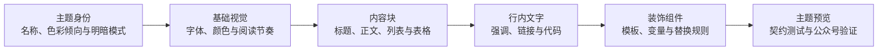

<p align="center">
  
</p>

<h1 align="center">墨鱼排版</h1>

<p align="center">
  把 Markdown 变成好看的公众号文章。<br>
  打开文件，挑选主题，微调样式，然后直接复制到公众号。
</p>

<p align="center">
  <strong>22 套主题</strong>　·　<strong>4 种色调</strong>　·　<strong>亮暗双外观</strong>　·　<strong>无需注册</strong>　·　<strong>内容不上传</strong>
</p>

<p align="center">
  <a href="https://moyu.liaobuqi.ren"><strong>在线体验 →</strong></a>
</p>


## 写好内容，剩下的交给墨鱼

公众号排版不应该从反复调字号、间距和颜色开始。

墨鱼排版把常用的排版能力放进一个清晰的工作台：左侧在主题和样式之间切换，中间专注查看实时排版，右侧直接编辑 Markdown。你可以从编辑器标题栏导入本地 Markdown、直接拖入文件，也可以在编辑器中粘贴或修改内容；满意后点击「复制到公众号」，回到公众号编辑器粘贴即可。

整个过程只有三步：

1. **写好文章**：导入、拖入或直接在线编辑 Markdown。
2. **选好风格**：从 22 套主题中找到适合内容的一套，在旁边实时查看效果。
3. **复制发布**：一键复制公众号富文本并打开公众号后台，直接粘贴后继续发布。

## 换个主题，文章马上换种气质

<p align="center">
  
</p>

主题不是简单换个颜色。标题、正文、引用、列表、代码、图片和装饰模块都会随主题重新组织，让同一篇文章适配不同的表达场景。

<table>
  <tr>
    <td align="center"></td>
    <td align="center"></td>
    <td align="center"></td>
  </tr>
  <tr>
    <td align="center"><strong>潮流黑卡</strong></td>
    <td align="center"><strong>瑞士红线</strong></td>
    <td align="center"><strong>新中式</strong></td>
  </tr>
</table>

除此之外，还有文学留白、典雅品牌、极客蓝图、孟菲斯彩块、千禧霓虹、侘寂大地等风格。主题按「黑白、暖色、冷色、多彩」归类，也可以直接搜索名称；每款主题都能切换亮色或暗色外观。

## 不只是套模板

- **22 套即用主题**：从克制长文到强视觉海报，覆盖常见公众号内容。
- **在线编辑与实时预览**：CodeMirror 编辑器提供 Markdown 高亮、搜索、撤销重做和常用格式工具栏，输入内容即时进入预览。
- **双栏滚动同步**：编辑区与预览区保持相同阅读进度，分割线可以按写作习惯拖动。
- **单篇本地自动保存**：当前 Markdown 自动保存在浏览器本地，刷新后继续编辑，也可以随时恢复示例内容。
- **5 组样式设置**：按文本、图片、背景、装饰和底板微调，不必改 CSS。
- **桌面与手机预览**：在发布前检查不同阅读尺寸下的实际表现。
- **图表自动转图片**：识别 Mermaid、Graphviz 图表，在浏览器本地转成高清 PNG Base64。
- **表格直接排版**：支持 GFM 表格、任务列表与删除线，常见 Markdown 内容无需手工改写。
- **常用代码高亮**：支持 JSON、Java、TypeScript、Kotlin、Shell、YAML、SQL 等常用语言，复制后保留颜色层次。
- **中文文件名可直接使用**：选择 `.md` 或 `.markdown` 文件即可载入。
- **本地配图补全**：检测 Markdown 相对路径图片，一次授权文章所在文件夹后即可完整预览，图片不会上传。
- **本地处理**：导入和编辑的文章不会上传；自动草稿只写入当前浏览器的本地存储。
- **公众号富文本复制**：预览满意后直接复制，不需要手工重排一遍。
- **手机阅读模式**：移动端自动隐藏复杂编辑面板，像阅读公众号文章一样浏览，并可从底部快速切换主题。

## 图表代码，也能直接带进公众号

Markdown 中使用 `mermaid`、`dot` 或 `graphviz` 代码块即可。导入或编辑文章时，墨鱼会按需载入对应渲染器，在当前浏览器中生成 PNG，再以内嵌 Base64 图片参与预览和复制。


流程图、时序图、类图、状态图、ER 图、甘特图、思维导图等 Mermaid 支持的图表都可以使用；Graphviz 用户也可以继续使用熟悉的 DOT 语法。整个过程不依赖服务端，图表源码不会上传。

## 主题色调

| 色调 | 代表主题 |
| --- | --- |
| 黑白 | 清爽正文、重磅黑白、细线极简 |
| 暖色 | 法式书报、侘寂大地、新中式 |
| 冷色 | 蓝调卡片、玻璃蓝光、极客蓝图 |
| 多彩 | 孟菲斯彩块、粗线撞色、千禧霓虹 |

每一款主题都提供同版式的亮色和暗色外观；色调负责表达视觉气质，亮暗负责适配阅读环境。

## 立即体验

直接访问 [moyu.liaobuqi.ren](https://moyu.liaobuqi.ren)，无需安装或注册。项目内置了一篇说明型示例文档，打开后无需准备内容，就能先浏览全部能力。

如果希望在本地运行：

```bash
npm run setup
npm run dev
```

浏览器打开终端显示的地址，然后：

- 点击右侧编辑器标题栏的「导入」选择本地文章；
- 把 Markdown 文件拖进预览区；
- 或直接在右侧 Markdown 编辑器粘贴、继续写作，在中间实时查看排版结果。

需要在启动时直接使用指定文章，也可以执行：

```bash
npm run dev -- /absolute/path/to/article.md
```

要求 Node.js `20.19.x` 或 `22.12+`。

## 免费部署

墨鱼排版可以构建为静态站点，不依赖数据库和后端 API，适合部署到 Cloudflare Pages、Netlify、Vercel 等静态托管服务。

```bash
npm run build
```

将生成的 `dist` 目录发布出去即可。用户选择的本地 Markdown 仍由浏览器读取，不会上传到托管平台。

## 一起设计更好看的主题

墨鱼排版不想规定公众号文章只能长成一种样子。现在的 22 套主题仍然不可能覆盖每个人的内容、品牌和审美偏好。

如果你对字体、配色、编辑设计或品牌视觉比较敏感，欢迎把你的判断带进来。现有主题没有满足你的需求时，不妨亲手做一套：它可以克制安静，也可以大胆鲜明；重要的是让内容更好读，并且拥有清楚、一致的视觉语气。

一套主题不是一张固定截图，而是由几层可以组合的设计规则构成：



主题集中定义在 `src/data/themes.json`：`palette` 声明色彩倾向、明暗模式和主次强调色，`base` 建立整体基调，`block` 控制标题和正文等内容块，`inline` 处理强调文字，`components` 与 `rules` 组合更有辨识度的标题和装饰。主题卡的底色与正文色直接取自实际文章容器配置。

完整的字段说明、制作步骤、公众号兼容原则和提交检查清单，请阅读 [主题贡献指南](./CONTRIBUTING.md)。除了主题，也欢迎提交交互改进、新内容块或问题修复。

## 随缘支持

如果墨鱼刚好帮你省下了一点排版时间，欢迎请作者喝杯咖啡。量力随缘；一个 Star、一句建议或分享给朋友，同样是很好的支持。

<details>
  <summary>展开收款码</summary>
  <br>
  <table>
    <tr>
      <td align="center"></td>
      <td align="center"></td>
    </tr>
    <tr>
      <td align="center">支付宝</td>
      <td align="center">微信支付</td>
    </tr>
  </table>
</details>

墨鱼排版由 [「了不起的人」](https://liaobuqi.ren) 制作。那里还有更多作品和折腾记录，欢迎偶尔去坐坐。

## 开源协议

[MIT License](./LICENSE)
