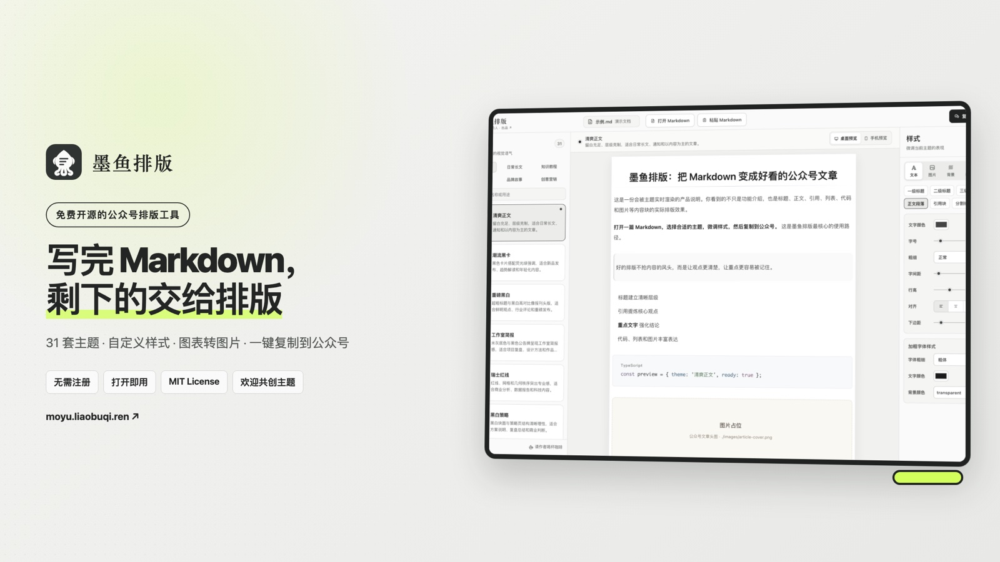
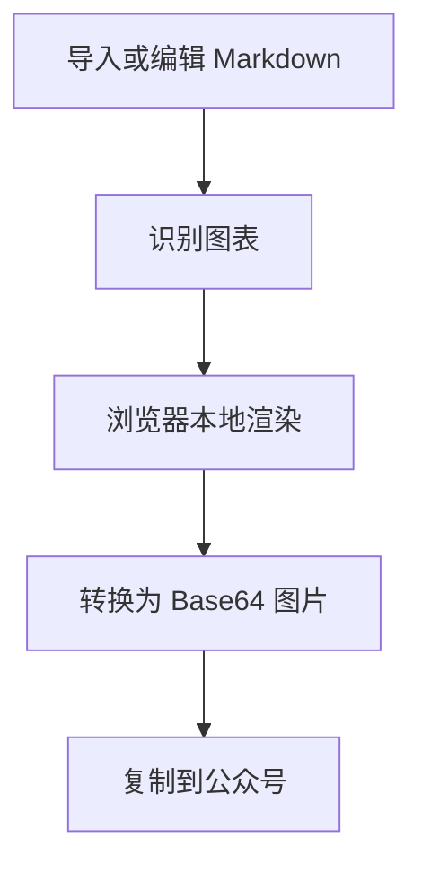

# 墨鱼排版：把 Markdown 变成好看的公众号文章

这是一份会被主题实时渲染的产品说明。你看到的不只是功能介绍，也是标题、正文、引用、列表、代码和图片等内容块的实际排版效果。

**在线编辑 Markdown，选择合适的主题，实时预览，然后复制到公众号。** 这是墨鱼排版最核心的使用路径。

> 好的排版不抢内容的风头，而是让观点更清楚，让重点更容易被记住。

1. 标题建立清晰层级
2. 引用提炼核心观点
3. **重点文字** 强化结论
4. 代码、列表和图片丰富表达

```ts
const preview = { theme: '清爽正文', ready: true };
```



## 一、导入或编辑你的 Markdown

点击右侧编辑器标题栏的「导入」，就可以选择电脑里的 `.md` 或 `.markdown` 文件。文件只在当前浏览器中读取，不会上传到服务器；后续编辑会自动保存为当前浏览器里的单篇本地草稿。

如果文章已经在剪贴板里，可以直接粘贴到右侧编辑器，或从空白内容开始写作。刷新页面后，工作台会恢复上一次自动保存的内容；点击「恢复示例」可以回到这份说明。

> 内容属于创作者。排版工具只在当前浏览器本地保存草稿和呈现结果，不把文章传到别处。

### 本地文件的使用特点

1. 文件选中后立即渲染，不需要提交或等待上传
2. 切换主题时正文保持不变，可以快速横向比较
3. 自定义样式只影响预览和复制结果
4. 编辑内容自动保存在浏览器本地，刷新后可以继续写作

## 二、主题决定文章的视觉语气

左侧主题库按视觉色调整理为五类。每张主题卡只展示名称和代表性色板，可以直接切换并体验完整排版效果。每一款主题都有同版式的亮色和暗色外观，切换时不会改变文章结构。

- **全部**：浏览所有主题
- **黑白**：黑、白、灰与低饱和中性色
- **暖色**：红、橙、黄、棕与米色
- **冷色**：蓝、青、绿与紫色
- **多彩**：包含多种鲜明强调色
当前默认使用的「清爽正文」以黑白灰为主；「潮流黑卡」强调荧光绿；「瑞士红线」则由灰白、炭黑与红色构成。它们都可以独立切换亮色或暗色阅读表面。

> 主题不是简单换颜色。标题组件、引用形式、分割线、图片边框和正文节奏都会随主题一起变化。

## 三、内容块会怎样呈现

下面每一段都在直接展示对应的 Markdown 效果。切换左侧主题，可以立即观察它们之间的差异。

### 标题层级

一级标题负责文章主旨，二级标题组织章节，三级标题适合小节。不同主题可能把标题渲染成编号、色块、边框或留白式结构。

### 正文与自定义文字设计

普通正文承担主要阅读内容。点击左侧的「样式」，可以在「文本」面板修改字号、颜色、字重、字间距、行高、对齐方式和段落间距。

Markdown 中的 **重点文字可以拥有独立颜色、字重和背景**，适合标记结论、数据与行动建议。斜体适合轻度强调，`行内代码` 适合呈现字段名、命令或短代码。

### 引用块

> 好的引用不是为了打断阅读，而是帮助读者抓住最值得记住的一句话。
>
> 引用中的 **重点文字** 仍然会保留主题强调效果。

### 列表

- 用无序列表并列观点
- 用 **加粗文字** 标出每项重点
- 用 `代码样式` 表达参数或配置
- 保持每一项简短，让内容更容易扫描

1. 导入或编辑 Markdown
2. 选择文章主题
3. 调整文字与图片样式
4. 在手机阅读宽度下校对效果
5. 复制到公众号后台

### 表格

表格适合对比功能、参数与结论。较宽的表格会保留完整结构，并允许横向查看。

| 色调 | 代表主题 | 主要颜色 |
| :--- | :--- | :--- |
| 黑白 | 清爽正文、重磅黑白 | 黑、白、灰 |
| 暖色 | 法式书报、侘寂大地、新中式 | 橙、棕、米色 |
| 冷色 | 蓝调卡片、玻璃蓝光 | 蓝、青、紫 |
| 多彩 | 孟菲斯彩块、粗线撞色 | 多种高辨识度强调色 |

亮暗外观与色调相互独立，因此同一款暖色、冷色或多彩主题都能在亮色和暗色阅读环境中使用。

### 任务列表与删除线

- [x] 导入或编辑 Markdown
- [x] 选择合适的文章主题
- [ ] 完成最终校对并发布

当观点需要修订时，可以用 ~~已经过时的结论~~ 表达内容变化。

### 代码块

支持 JSON、Java、TypeScript、JavaScript、Kotlin、Shell、YAML、HTML、CSS、SQL、Markdown、Python、Go 与 Properties 等常用语言。代码颜色会直接写入复制内容，粘贴到公众号后仍能保留层次。

```json
{
  "product": "墨鱼排版",
  "themes": 22,
  "readyToPublish": true
}
```

```ts
const article = {
  source: 'local-markdown',
  theme: 'clean-editorial',
  readyToPublish: true,
};

console.log('所见即所得', article);
```

```java
record Article(String source, String theme, boolean readyToPublish) {}

var article = new Article("local-markdown", "clean-editorial", true);
```

### Mermaid 与 Graphviz 图表

文章中的 `mermaid`、`dot` 或 `graphviz` 代码块会在浏览器本地渲染成高清 PNG，并以内嵌 Base64 图片呈现。复制到公众号时带走的是图片，不需要公众号理解图表语法，也不会把图表内容提交给服务器。



### 图片与图片占位

Markdown 中的网络图片和 Base64 图片可以直接显示。打开包含本地相对路径图片的文章时，墨鱼会先保留清晰的图片占位，并提示你点击「显示配图」。选择 Markdown 所在文件夹后，正文引用的图片会在当前浏览器中转换并显示，不会上传到服务器。

浏览器允许继续使用上次授权的文件夹时，墨鱼会先校验其中的 Markdown 是否与当前文章一致，再自动补全配图，避免误用其他文章里的同名文件。

在左侧「样式」的图片面板中，还可以调整最大宽度、圆角、阴影、图片说明和图片间距。

## 四、样式面板可以改什么

左侧样式面板用于微调当前主题。修改会即时反映在预览中，不需要反复保存或刷新。

### 文本

调整标题、正文、引用、分割线和加粗文字，让信息层级更贴合文章气质。

### 图片

控制宽度、圆角、阴影、说明文字和上下间距，让配图与正文形成统一节奏。

### 背景与装饰

修改文章容器背景、内外边距，以及主题自带装饰组件的可编辑颜色。

### 底板

为预览区域添加网格、圆点或交叉底纹，适合需要更强视觉识别的内容。

> 如果调整得太多，点击样式面板右上角的重置按钮，即可回到当前主题的原始效果。

## 五、预览与发布

电脑端预览使用手机外壳和公众号页头还原实际阅读环境，正文在手机屏幕内独立滚动，便于检查换行、留白和标题节奏。用手机访问时，页面会自动精简为文章阅读模式，并在底部保留轻量的主题切换栏。

确认效果后，点击「复制到公众号」。墨鱼排版会把当前主题和自定义样式一起写入剪贴板，同时打开微信公众号后台，随后可以直接粘贴到编辑器。

**内容由你决定，主题帮你表达，样式负责把细节打磨到位。**

## 现在开始

你可以继续用这份说明切换主题、调整文字，也可以打开自己的 Markdown，开始一次真实的排版。
