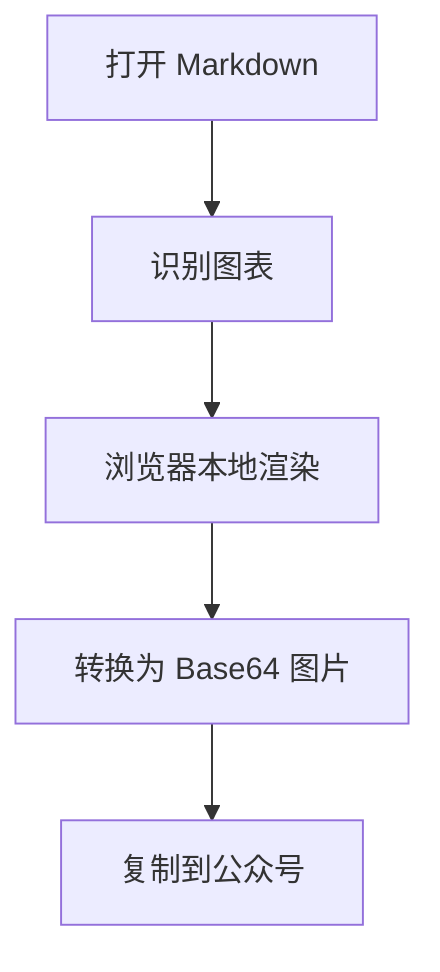

# 墨鱼排版：把 Markdown 变成好看的公众号文章

这是一份会被主题实时渲染的产品说明。你看到的不只是功能介绍，也是标题、正文、引用、列表、代码和图片等内容块的实际排版效果。

**打开一篇 Markdown，选择合适的主题，微调样式，然后复制到公众号。** 这是墨鱼排版最核心的使用路径。

> 好的排版不抢内容的风头，而是让观点更清楚，让重点更容易被记住。

1. 标题建立清晰层级
2. 引用提炼核心观点
3. **重点文字** 强化结论
4. 代码、列表和图片丰富表达

```ts
const preview = { theme: '清爽正文', ready: true };
```


---

## 一、先打开你的 Markdown

点击顶部的「打开 Markdown」，就可以选择电脑里的 `.md` 或 `.markdown` 文件。文件只在当前浏览器页面中读取，不会上传到服务器，也不会被保存。

如果文章已经在剪贴板里，也可以使用「粘贴 Markdown」直接开始预览。刷新页面后，工作台会重新载入「示例.md」。

> 内容属于创作者。排版工具只负责在本地呈现，不替你保存，也不把文章传到别处。

### 本地文件的使用特点

1. 文件选中后立即渲染，不需要提交或等待上传
2. 切换主题时正文保持不变，可以快速横向比较
3. 自定义样式只影响预览和复制结果
4. 刷新页面后回到演示文档，避免遗留隐私内容

---

## 二、主题决定文章的视觉语气

左侧主题库按文章用途整理为六类。你可以先确定内容方向，再观察同一份内容如何改变阅读感受。

- **全部模板**：浏览完整的排版样式
- **日常长文**：通知、随笔、社群与常规推文
- **知识教程**：教程、方法、复盘与专业解释
- **商业科技**：产品发布、行业观察与商业分析
- **品牌故事**：品牌故事、人文内容与生活方式
- **创意营销**：活动、热点、营销与强视觉表达

当前默认使用的「清爽正文」强调留白、节奏与可读性；「潮流黑卡」更适合新品和年轻化内容；「瑞士红线」则用网格秩序承载商业分析与专业报告。

> 主题不是简单换颜色。标题组件、引用形式、分割线、图片边框和正文节奏都会随主题一起变化。

---

## 三、内容块会怎样呈现

下面每一段都在直接展示对应的 Markdown 效果。切换左侧主题，可以立即观察它们之间的差异。

### 标题层级

一级标题负责文章主旨，二级标题组织章节，三级标题适合小节。不同主题可能把标题渲染成编号、色块、边框或留白式结构。

### 正文与自定义文字设计

普通正文承担主要阅读内容。你可以在右侧「文本」面板修改字号、颜色、字重、字间距、行高、对齐方式和段落间距。

Markdown 中的 **重点文字可以拥有独立颜色、字重和背景**，适合标记结论、数据与行动建议。斜体适合轻度强调，`行内代码` 适合呈现字段名、命令或短代码。

### 引用块

> 好的引用不是为了打断阅读，而是帮助读者抓住最值得记住的一句话。
>
> 引用中的 **重点文字** 仍然会保留主题强调效果。

### 列表

- 用无序列表并列观点
- 用 **加粗文字** 标出每项重点
- 用 `代码样式` 表达参数或配置
- 保持每一项简短，让内容更容易扫描

1. 打开 Markdown
2. 选择文章主题
3. 调整文字与图片样式
4. 切换桌面或手机预览
5. 复制到公众号后台

### 代码块

```ts
const article = {
  source: 'local-markdown',
  theme: 'clean-editorial',
  readyToPublish: true,
};

console.log('所见即所得', article);
```

### Mermaid 与 Graphviz 图表

文章中的 `mermaid`、`dot` 或 `graphviz` 代码块会在浏览器本地渲染成高清 PNG，并以内嵌 Base64 图片呈现。复制到公众号时带走的是图片，不需要公众号理解图表语法，也不会把图表内容提交给服务器。



### 图片与图片占位

Markdown 中的网络图片和 Base64 图片可以直接显示。本地相对路径无法被静态网页自动读取，因此会呈现为清晰的图片占位，并保留图片说明和原路径，方便理解文章结构。

在右侧「图片」面板中，还可以调整最大宽度、圆角、阴影、图片说明和图片间距。

---

## 四、样式面板可以改什么

右侧面板用于微调当前主题。修改会即时反映在中间预览中，不需要反复保存或刷新。

### 文本

调整标题、正文、引用、分割线和加粗文字，让信息层级更贴合文章气质。

### 图片

控制宽度、圆角、阴影、说明文字和上下间距，让配图与正文形成统一节奏。

### 背景与装饰

修改文章容器背景、内外边距，以及主题自带装饰组件的可编辑颜色。

### 底板

为预览区域添加网格、圆点或交叉底纹，适合需要更强视觉识别的内容。

> 如果调整得太多，点击样式面板右上角的重置按钮，即可回到当前主题的原始效果。

---

## 五、预览与发布

顶部的「桌面预览」适合检查完整文章结构，「手机预览」用于观察窄屏阅读时的换行、留白和标题节奏。

确认效果后，点击「复制到公众号」。墨鱼排版会把当前主题和自定义样式一起写入剪贴板，随后可以直接粘贴到公众号编辑器。

**内容由你决定，主题帮你表达，样式负责把细节打磨到位。**

---

## 现在开始

你可以继续用这份说明切换主题、调整文字，也可以打开自己的 Markdown，开始一次真实的排版。
